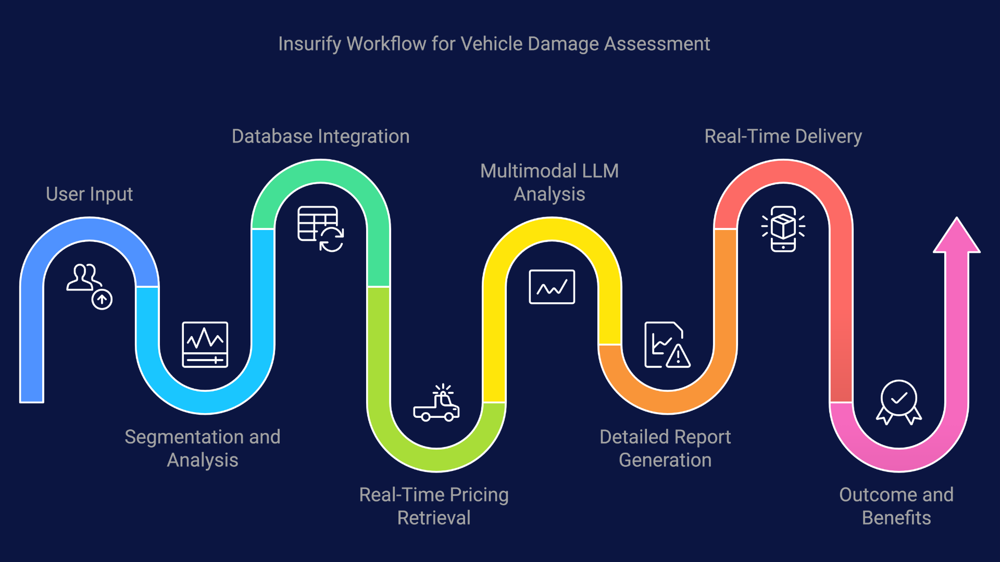
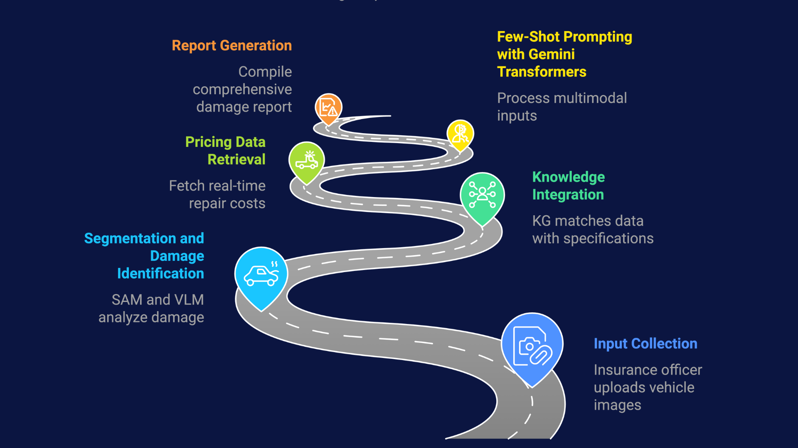

# 🏦 Insurify - AI-Driven Insurance Automation Platform

## 🌟 Introduction ✨🚀
🤖 Insurify is an **AI-powered insurance automation platform** 💰 designed to **optimize claims processing, vehicle damage assessment, and real-time cost estimation**. By leveraging **🧠 AI pipelines, 📊 knowledge graphs, and ⏱️ real-time data integration**, Insurify enhances **speed, accuracy, and transparency** in the insurance sector. 🚀

## 🚀 Key Features 🎯🔥
### 1️⃣ 🤖 AI-Powered Claims Processing
✅ **Deep Learning for Image Processing** - Automates **vehicle damage assessment** 📸.
✅ **Real-Time Repair Cost Estimation** - Provides **instant part replacement suggestions** 💰.
✅ **Automated Claim Validation** - Enhances accuracy using **AI-driven verification** ✅.

### 2️⃣ 📊 Intelligent Data Handling
✅ **Knowledge Graph-Based Claims Processing** - Uses **Neo4j** for structured data management 🧠.
✅ **Fast Real-Time Data Retrieval** - Implements **Redis for low-latency processing** ⚡.
✅ **Automated Report Generation** - AI-powered **report validation & claim insights** 📄.

### 3️⃣ 🌍 Scalable AI & Web Integration
✅ **FastAPI Backend** - Efficient API handling with **real-time WebSocket processing** 🔄.
✅ **ReactJS Frontend** - Provides **user-friendly dashboards for claim tracking** 💻.
✅ **Firebase Authentication & Storage** - Secure **user & document management** 🔐.

---

## 🔄 Workflows 🏗️🔃
### 📜 Overall Workflow

### 🧠 Knowledge Graph Integration

### ⚙️ AI Pipelines

### 🗺️ Roadmaps

---

## 🛠️ Tech Stack 🏗️🚀🧑‍💻
### 🤖 AI & Automation 🧠
- **Deep Learning Models** - Image-based **damage assessment** 📸.
- **LangChain & CrewAI** - LLM-powered **intelligent claim validation** 🤖.
- **LangGraph & LangFlow** - AI output **optimization & automation** 🛠️.

### ⚙️ Backend & Databases 🔧
- **FastAPI** - High-performance API framework for claim processing 🚀.
- **Neo4j Graph Database** - Enhances **structured claim relationships** 🗂️.
- **Redis** - Speeds up **real-time data retrieval** ⚡.
- **Firebase** - Secure **storage & authentication** 🔐.

### 🌐 Frontend & Deployment 🖥️
- **ReactJS** - User-friendly **dashboard for insurance officers & customers** 💻.
- **WebSockets** - Enables **real-time claim status updates** 🔄.
- **Docker** - Containerized deployment for **scalability & flexibility** 🐳.

---

## 🎯 Impact & Future Scope 🚀🌍
✅ **Reduces manual claim processing time** with **AI-driven automation** 🏎️.
✅ **Enhances fraud detection & verification** using **LLMs & AI workflows** 🔍.
✅ **Provides real-time insurance analytics** for **better decision-making** 📊.

### 🚀 Future Enhancements 🔮✨
✅ Expanding AI pipelines for **multi-modal damage detection** 📡.
✅ Integration with **blockchain for secure claim validation** 🔗.
✅ Enhancing chatbot-based **insurance guidance & support** 💬.

---

## 🙌 Conclusion 🎉👏
Insurify revolutionizes the **insurance industry** with AI-powered **claims processing, fraud detection, and real-time analytics**. By leveraging **intelligent automation, real-time workflows, and scalable web integration**, Insurify improves **efficiency, accuracy, and transparency** in insurance operations. 🚀

💡 **Stay tuned for more innovations in AI-driven insurance automation!** 🚀🔥

---

🙏 **Thank You!** 🎉
